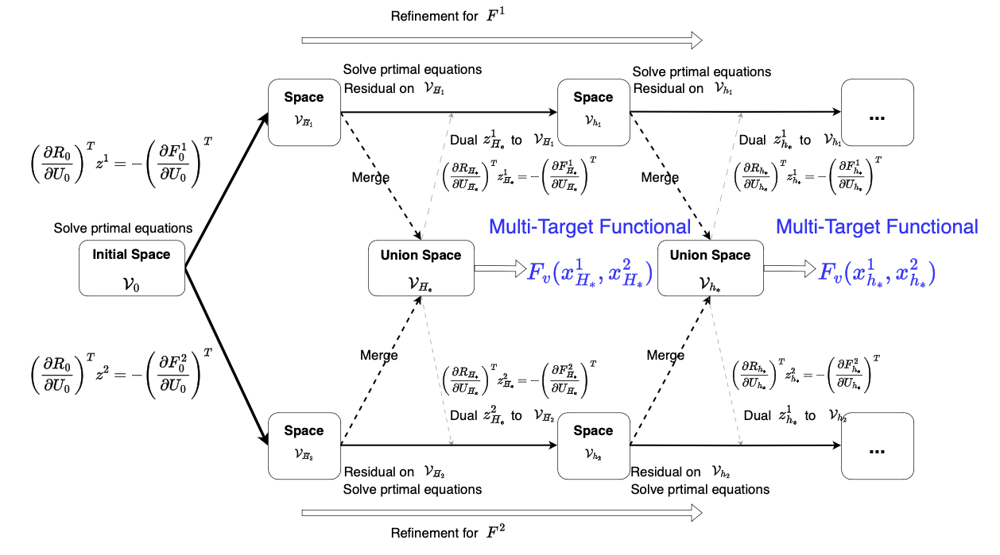
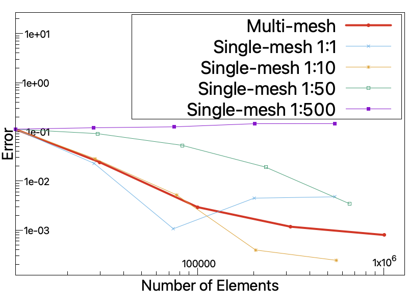
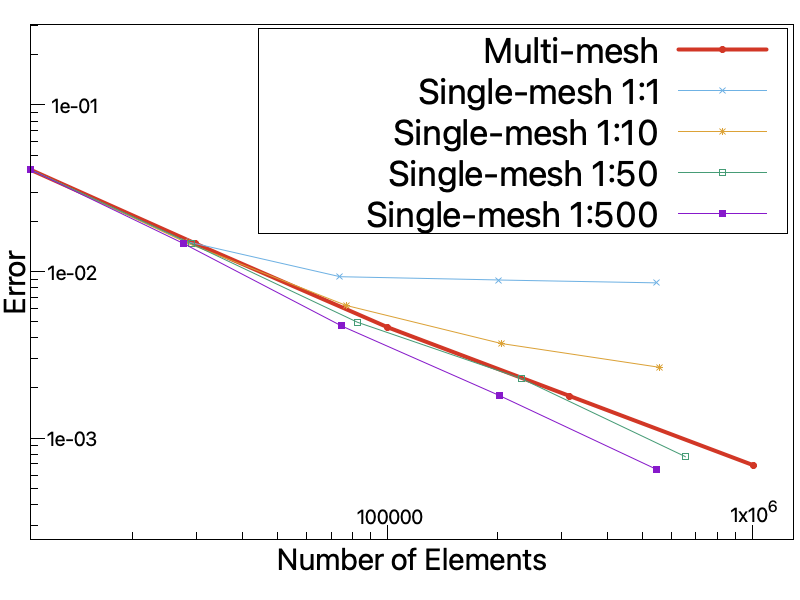
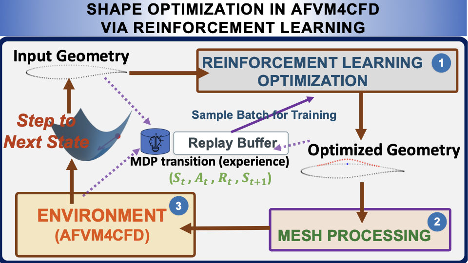
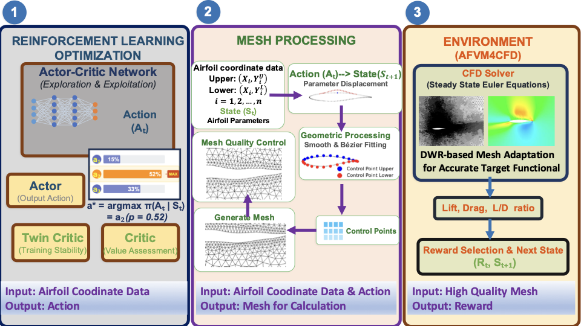

I am Jingfeng Wang, a postdoctoral research scholar at North Carolina State University. I received my Ph.D. from the University of Macau in 2024, and my B.S. from Sichuan University in 2020. My research lies at the intersection of partial differential equations, optimization, and machine learning. Discussions and collaborations are warmly welcomed.

## Research Interest

My work spans **numerical methods for PDEs**, **machine learning in PDE fields**, and their integration for scientific computing.

---

### Numerical Methods for PDEs

A central theme of my work is **adjoint-based mesh adaptation**. During my Ph.D., in joint work with my advisor Prof. Guanghui Hu, I developed an automatic dual-consistent mesh adaptation method for the steady Euler equations within [AFVM4CFD](https://ghhu.github.io/software.html), the CFD library maintained by our group, and proposed a hybrid CNN+Dual approach that significantly accelerates the adaptation procedure.

**Multi-mesh method for multi-target functionals.** Real applications often involve nonlinear or composite functionals beyond simple drag/lift, where existing theoretical guarantees no longer apply. A multi-mesh framework offers a principled way to handle such cases by allocating an adapted mesh to each target.

<figure>
    
    <figcaption>Workflow of the multi-mesh adaptation procedure.</figcaption>
</figure>

<figure>
    
    
    <figcaption>Lift (left) and drag (right) errors when computing the lift-to-drag ratio. Single-mesh accuracy fluctuates sharply with the lift&ndash;drag weighting (1:1 to 1:500), whereas the multi-mesh framework remains stable and parameter-insensitive.</figcaption>
</figure>

**Towards more realistic models.** The current framework relies on the steady Euler equations with mirror-reflection boundary conditions. Capturing boundary-layer effects in airfoil shape optimization will require richer models such as Navier&ndash;Stokes and Boltzmann equations.

---

### Machine Learning in PDE Fields

I view machine learning as a complement to&mdash;not a replacement for&mdash;classical numerical methods. My recent work explores **reinforcement learning for shape and geometry optimization**, with classical-method-informed learning frameworks: e.g., airfoil shape optimization driven by a CFD solver, and molecular geometry optimization driven by DFT.

<figure>
    
    
    <figcaption>Top: the overall RL optimization loop. Bottom: the mechanism-driven algorithmic details.</figcaption>
</figure>

**Multi-agent exploration.** Multi-agent training accelerates data collection&mdash;a classical bottleneck of RL exploration&mdash;and naturally accommodates conventional optimization tools such as the adjoint method within the learning loop.

**Data-driven discretization with classical structure.** Classical discretization remains indispensable for an efficient and credible solver: it informs network design (e.g., handling rotational/translational invariance in molecules, or non-smooth airfoil geometries) and provides reliable evaluations during optimization. I am developing data-driven discretizations that retain these structural guarantees while leveraging the speed of learned components.
