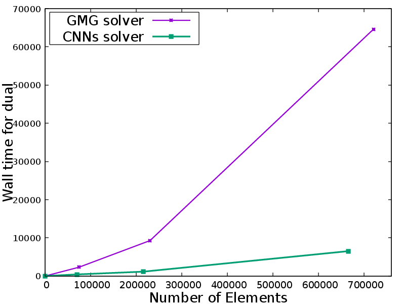
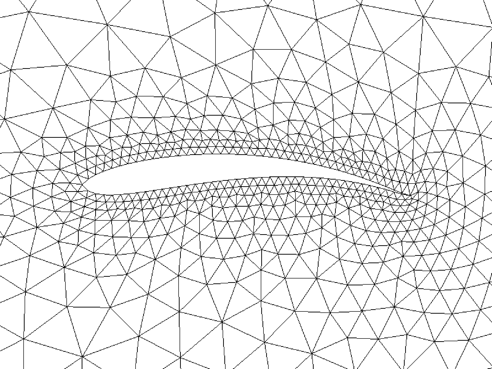

My research interests range from numerical methods for partial differential equations (PDEs), machine learning, and optimization.

**Numerical Methods in PDEs**

A key focus of my research is the development of mesh adaptation methods designed to fulfill a variety of computational needs. During my Ph.D. studies, I embarked on research into adjoint-based mesh adaptation. I developed an automatic dual consistent mesh adaptation method based on the steady Euler equations within AFVM4CFD, a library our group maintains. Furthermore, I introduced a hybrid approach combining Convolutional Neural Networks (CNNs) and a Dual solver to expedite the mesh adaptation process.

<figure>
    
    
    <figcaption>The CNNs solver saves time significantly while preserving the accuracy of target functional.</figcaption>
</figure>

Despite the strides made in developing such a powerful solver, challenges persist that necessitate further enhancements.Following aspects are those I am working on and should be improved upon in the future:

* Multi-mesh method for multi-target functionals

In actual applications, the target functionals are much more complicated than the drag or lift calculation. However, theoretical analysis can not guanrantee the framework can be generalized to nonlinear and composite target functionals. Thus, multi-mesh is a potential method that can fufill the requirements.

* Incorporation of More Realistic Scenarios

The existing framework, built on steady Euler equations and mirror reflection boundary conditions, offers a foundation. However, the intricacies of airfoil shape optimization demand a deeper dive, particularly into boundary layer issues. Our ambition is to incorporate more sophisticated models, including Navier-Stokes and Boltzmann equations, to capture the nuanced impacts on geometry more accurately. 

**Machine Learning in PDE Fields**

I believe machine learning is a competitive technique in numerical calculation. I prefer to integrate machine learning with classical methods instead of substituting them. For example, I use the convolutional neural network to enhance the mesh adaptation but remain the solver for the governing equations. Currently, I am exploring reinforcement learning for optimization and trying to enhance such a process by classical method-informed learning frameworks. For example, the shape optimization of airfoil based on the CFD model and geometrical optimization of a molecule based on the DFT model.

<figure>
    
    
    <figcaption> Optimized from NACA0012 with different obejectives. Left: minimize drag, Right: maximize lift-drag ratio.</figcaption>
</figure>

In order to make the optimization more effective, my research focused on the following aspects:

* Multi-agent Exploration

The advent of multi-agent training offers a promising avenue for enhancing the efficiency of data accumulation in reinforcement learning, a field traditionally hampered by the extensive data demands of its exploration phase. Besides, this tenique can naturally integrate the conventional optimization method like the adjoint method within the learning framework. 

* Fusion of Data-Driven Discretization and Conventional Numerical Methods

I believe the conventional numerical method is indispensable for developing a highly efficient solver even within a learning framework. With the help of classical framework, we can design more resonable network structures. During the optimization process, a credible solver is the foundation to conduct further calculation. For example, the rotational and translational invariance in molecular design, non-smooth geometry for airfoil design may suffer a lot from a pure learning-based solver. However, the speed of machine learning method is attractive to develop the optimization algorithm. Then, I am also woking on the data-driven discretization to make the calculation more quickly.
