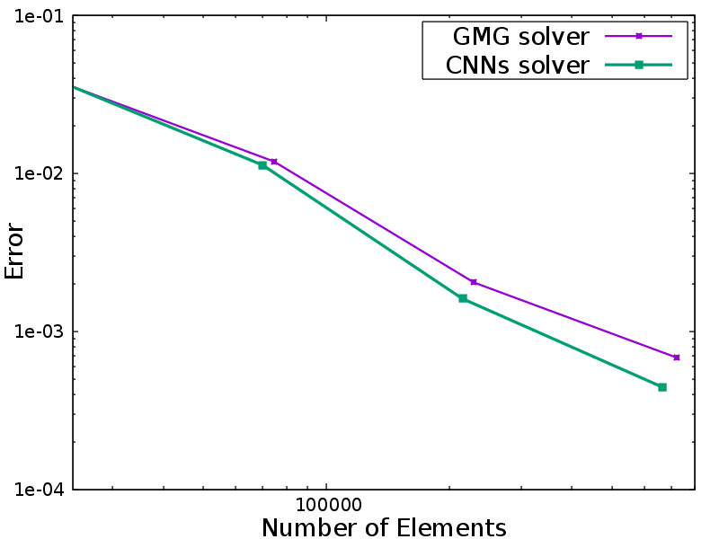

My research interests range from numerical methods for partial differential equations (PDEs), machine learning, and optimization.

**Numerical Methods in PDEs**

A key focus of my research is the development of mesh adaptation methods designed to fulfill a variety of computational needs. During my Ph.D. studies, I embarked on research into adjoint-based mesh adaptation. I developed an automatic dual consistent mesh adaptation method based on the steady Euler equations within AFVM4CFD, a library our group maintains. Furthermore, I introduced a hybrid approach combining Convolutional Neural Networks (CNNs) and a Dual solver to expedite the mesh adaptation process.

<figure>
    
    
    <figcaption>Compared with the conventional GMG solver, the CNNs solver saves time significantly while preserving the accuracy of target functional.</figcaption>
</figure>

Despite the strides made in developing such a powerful solver, challenges persist that necessitate further enhancements.Following aspects are those I am working on and should be improved upon in the future:

* Multi-mesh method for multi-target functionals

In actual applications, the target functionals are much more complicated than the drag or lift calculation. However, theoretical analysis can not guanrantee the framework can be generalized to nonlinear and composite target functionals. Thus, multi-mesh is a potential method that can fufill the requirements.

* Incorporation of More Realistic Scenarios

The existing framework, built on steady Euler equations and mirror reflection boundary conditions, offers a foundation. However, the intricacies of airfoil shape optimization demand a deeper dive, particularly into boundary layer issues. Our ambition is to incorporate more sophisticated models, including Navier-Stokes and Boltzmann equations, to capture the nuanced impacts on geometry more accurately.

**Machine learning in PDE fields**

I view machine learning as a potent adjunct to numerical computation, preferring to amalgamate it with traditional methodologies rather than replace them. Presently, my research ventures into utilizing reinforcement learning for optimization, with an emphasis on augmenting such processes through classical method-informed learning frameworks. Notably, my projects include airfoil shape optimization leveraging CFD models and molecular geometrical optimization informed by DFT models.
